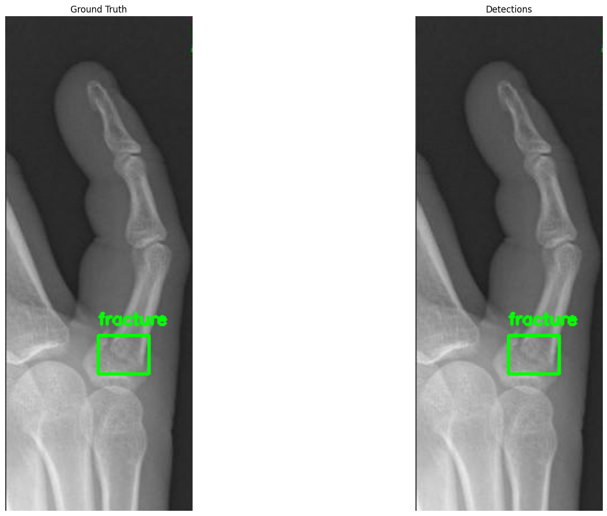

# Object Detection with DETR

This repository contains an implementation of DETR (DEtection TRansformer) for object detection tasks using PyTorch. DETR is a transformer-based neural network architecture that directly predicts object locations and classes in a single forward pass.



## Installation

To set up the environment for running the DETR implementation, follow these steps:

1. Clone the repository:
   ```bash
   git clone https://github.com/iamrukeshduwal/Object-Detection-DETR.git
   cd Object-Detection-DETR

2. Open detr_implementation.ipynb in Jupyter Notebook

Dataset URL: https://universe.roboflow.com/roboflow-100/bone-fracture-7fylg

Reference: https://github.com/NielsRogge/Transformers-Tutorials/blob/master/DETR/Fine_tuning_DetrForObjectDetection_on_custom_dataset_(balloon).ipynb

Original DETR paper: https://arxiv.org/abs/2005.12872

Original DETR repo: https://github.com/facebookresearch/detr
